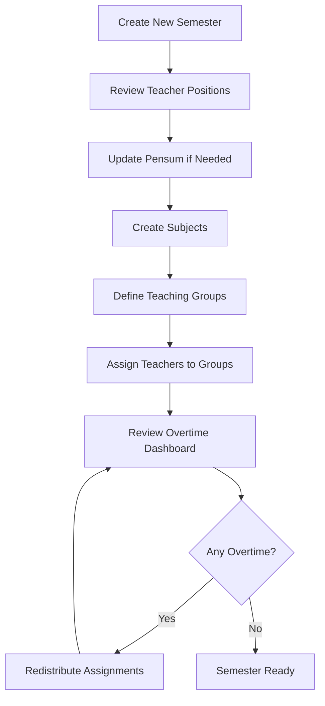

# Administrator Guide

Welcome to the NSOS Administrator Guide. This comprehensive resource will help you effectively manage your institution's teaching workload, monitor overtime, and optimize resource allocation.

## What You'll Learn

This guide covers everything you need to know as an NSOS administrator:

- **Teacher Management** - Creating accounts, defining positions, and managing pensum
- **Semester Setup** - Configuring academic periods and calendars
- **Subject Assignment** - Creating courses and assigning teaching groups
- **Overtime Monitoring** - Using the dashboard to track and prevent overtime
- **Reporting** - Generating reports for management and HR

## Quick Navigation

### Essential Tasks

<div class="task-grid">

#### 🎯 [Teacher Management](/administrator/teacher-management)

Create and manage teacher accounts, define academic positions, and set pensum values.

**Common tasks:**

- [Add a new teacher](/administrator/tasks/add-teacher)
- Update teacher positions
- Adjust pensum values

#### 📅 [Semester Setup](/administrator/semester-setup)

Configure academic semesters and manage the active teaching period.

**Common tasks:**

- Create new semester
- Activate semester
- Archive completed semester

#### 📚 [Subject Assignment](/administrator/subject-assignment)

Create subjects, define teaching groups, and assign teachers.

**Common tasks:**

- [Create teaching groups](/administrator/tasks/create-groups)
- Assign teachers to groups
- Update schedules and rooms

#### 📊 [Overtime Monitoring](/administrator/overtime-monitoring)

Monitor teacher workload in real-time and identify overtime situations.

**Common tasks:**

- [Handle overtime situations](/administrator/tasks/handle-overtime)
- Balance workload distribution
- Redistribute assignments

#### 📈 [Reporting](/administrator/reporting)

Generate comprehensive reports for management, HR, and planning.

**Common tasks:**

- Generate overtime reports
- Export semester data
- Create summary statistics

</div>

## Your Dashboard

When you log in as an administrator, you'll see the **Overtime Dashboard** - your central command center for workload management.

### Dashboard Overview

The dashboard provides at-a-glance insights:

| Section                 | Information                                           | Action           |
| ----------------------- | ----------------------------------------------------- | ---------------- |
| **Summary Cards**       | Total teachers, active semester, total overtime hours | Overview metrics |
| **Status Distribution** | Teachers by status (under/at/over pensum)             | Quick filtering  |
| **Teacher List**        | Complete roster with assigned hours and overtime      | Sort and filter  |
| **Alerts**              | Critical overtime situations requiring attention      | Immediate action |

### Status Indicators

Teachers are color-coded based on their workload status:

- 🟢 **Green (Under Pensum)** - Less than 95% of pensum assigned
- 🟡 **Yellow (Near Pensum)** - 95-100% of pensum assigned
- 🔴 **Red (Overtime)** - Over 100% of pensum assigned

::: tip Proactive Management
Focus on yellow status teachers when assigning new groups. This helps prevent overtime situations before they occur.
:::

## Typical Administrative Workflows

### Start of Semester Workflow

Follow this sequence for smooth semester setup:



**Estimated time:** 2-4 hours for a typical semester with 20-30 teachers

### Mid-Semester Adjustments

When changes are needed during the semester:

1. **Identify the Issue**

   - Teacher requests schedule change
   - New teaching group needs assignment
   - Enrollment changes require additional sections

2. **Assess Impact**

   - Check current teacher workload
   - Review overtime status
   - Consider schedule conflicts

3. **Make Adjustment**

   - Modify existing assignment
   - Reassign to different teacher
   - Create new teaching group

4. **Verify Results**
   - Check overtime dashboard
   - Confirm no new overtime situations
   - Communicate changes to affected teachers

### End of Semester Workflow

Prepare for semester conclusion:

1. **Generate Final Reports**

   - Overtime summary by teacher
   - Department-wide statistics
   - Comparison to previous semesters

2. **Review Workload Distribution**

   - Identify patterns and imbalances
   - Note teachers consistently at capacity
   - Document overtime trends

3. **Archive Semester**

   - Change semester status to inactive
   - Preserve data for historical reference
   - Prepare for next semester planning

4. **Plan Improvements**
   - Review what worked well
   - Identify assignment strategies that prevented overtime
   - Adjust position pensum if needed

## Key Responsibilities

### 1. Maintain Accurate Teacher Data

**Why it matters:** Accurate teacher information ensures correct pensum calculations and prevents overtime miscalculations.

**What to maintain:**

- Teacher names and contact information
- Current academic positions
- Employment type (full-time, part-time)
- Correct pensum values
- Active/inactive status

**When to update:**

- Teacher promotion or position change
- Contract renewal with different terms
- Teacher leaves institution
- Pensum adjustments approved by management

### 2. Optimize Teaching Assignments

**Why it matters:** Balanced workload distribution minimizes overtime costs and improves teacher satisfaction.

**Best practices:**

- Assign groups to teachers with available hours first
- Distribute high-hour courses evenly
- Consider teacher expertise and preferences when possible
- Leave buffer room (5-10 hours) below pensum for flexibility

**Warning signs:**

- Multiple teachers at exactly 100% of pensum (no flexibility)
- Few teachers with significant overtime while others are underutilized
- Unassigned groups at semester start

### 3. Monitor and Prevent Overtime

**Why it matters:** Overtime represents additional institutional costs and potential contract issues.

**Monitoring frequency:**

- **Weekly** during first 3 weeks of semester (high assignment activity)
- **Bi-weekly** during mid-semester (stable period)
- **As-needed** when making assignment changes

**Prevention strategies:**

- Review dashboard before creating new assignments
- Redistribute workload when teachers approach pensum
- Plan for contingencies (sick leave, sabbaticals)
- Maintain list of teachers with capacity for additional hours

### 4. Generate Timely Reports

**Why it matters:** Reports inform institutional decisions about hiring, compensation, and resource allocation.

**Standard reporting schedule:**

- **Week 1 of semester** - Initial assignment report
- **Mid-semester** - Current workload status
- **End of semester** - Final overtime and statistics
- **Ad-hoc** - As requested by management

**Report distribution:**

- Department heads
- HR/payroll department
- Academic affairs administration
- Budget/finance office (for overtime costs)

## Administrator Best Practices

### Do's ✅

- **Review overtime dashboard regularly** - Catch issues early
- **Communicate assignment changes** - Keep teachers informed
- **Document overtime justifications** - Maintain clear records
- **Plan ahead for known changes** - Sabbaticals, leaves, new hires
- **Use consistent naming conventions** - Easier to search and filter
- **Back up data before major changes** - Safety net for mistakes
- **Train backup administrators** - Ensure continuity

### Don'ts ❌

- **Don't assign groups without checking teacher capacity** - Causes unnecessary overtime
- **Don't ignore yellow status indicators** - They become red quickly
- **Don't make changes without noting reasons** - Hard to track history
- **Don't wait until end of semester to review overtime** - Too late to fix
- **Don't forget to communicate with teachers** - Reduces confusion
- **Don't create assignments in inactive semesters** - Data integrity issues

## Common Challenges and Solutions

### Challenge: Too Many Teachers in Overtime

**Symptoms:**

- Multiple red status indicators on dashboard
- Total overtime hours exceeding budget
- Unable to balance workload

**Solutions:**

1. Review pensum values - Are they realistic for current course offerings?
2. Consider hiring additional teachers or adjuncts
3. Redistribute lower-priority courses
4. Evaluate if some courses can be combined or cancelled
5. Propose pensum adjustments to management

### Challenge: Uneven Workload Distribution

**Symptoms:**

- Some teachers at 100%+ pensum while others at 70-80%
- Complaints about fairness
- Difficulty finding teachers for new assignments

**Solutions:**

1. Review assignment history - Are certain teachers always given preference?
2. Establish clear assignment criteria (expertise, availability, equity)
3. Implement rotation for popular/unpopular courses
4. Create policy for distributing high-hour courses
5. Use dashboard sorting to identify underutilized teachers

### Challenge: Frequent Assignment Changes

**Symptoms:**

- Teachers confused about schedule
- Multiple versions of assignments circulating
- Complaints from teachers about instability

**Solutions:**

1. Establish assignment deadline - Final changes by week 2
2. Implement change request process with justification
3. Communicate all changes immediately
4. Generate updated reports after changes
5. Use version control or notes to track change reasons

### Challenge: Missing or Incorrect Data

**Symptoms:**

- Pensum calculations seem wrong
- Teachers report incorrect schedules
- Reports show unexpected numbers

**Solutions:**

1. Audit teacher data - Verify positions and pensum
2. Check semester dates and active status
3. Review all teaching groups for completeness
4. Cross-reference with institutional records
5. Implement data validation checks

## Quick Reference

### Essential Formulas

```
Overtime Hours = Total Assigned Hours - Pensum
Utilization % = (Assigned Hours ÷ Pensum) × 100
Remaining Capacity = Pensum - Assigned Hours
```

### Status Thresholds

```
Under Pensum: < 95% utilization (Green)
Near Pensum: 95-100% utilization (Yellow)
Overtime: > 100% utilization (Red)
```

### Recommended Buffers

```
Per Teacher: 5-10 hours below pensum
Per Department: 10-15% total capacity reserve
Per Semester: Plan for 5% contingency hours
```

## Getting Help

### In This Guide

- [Teacher Management Details](/administrator/teacher-management)
- [Subject Assignment Step-by-Step](/administrator/subject-assignment)
- [Overtime Monitoring Strategies](/administrator/overtime-monitoring)
- [Common Task Recipes](/administrator/tasks/add-teacher)

### Additional Resources

- [Use Cases](/use-cases/overview) - Detailed scenarios
- [User Roles](/guide/user-roles) - Permission reference
- [Key Concepts](/guide/key-concepts) - System fundamentals

### Support Channels

- [GitHub Issues](https://github.com/przemekkojs/NSOS/issues) - Bug reports
- [GitHub Discussions](https://github.com/przemekkojs/NSOS/discussions) - Questions
- System Administrator - Technical issues
- Institution Admin - Policy questions

---

::: tip Ready to Start?
Begin with [Teacher Management](/administrator/teacher-management) to set up your teaching staff, then move on to [Semester Setup](/administrator/semester-setup) to configure your academic period.
:::

<style>
.task-grid {
  display: grid;
  grid-template-columns: repeat(auto-fit, minmax(250px, 1fr));
  gap: 1rem;
  margin: 2rem 0;
}

.task-grid h4 {
  margin-top: 0;
  color: var(--vp-c-brand);
}
</style>
